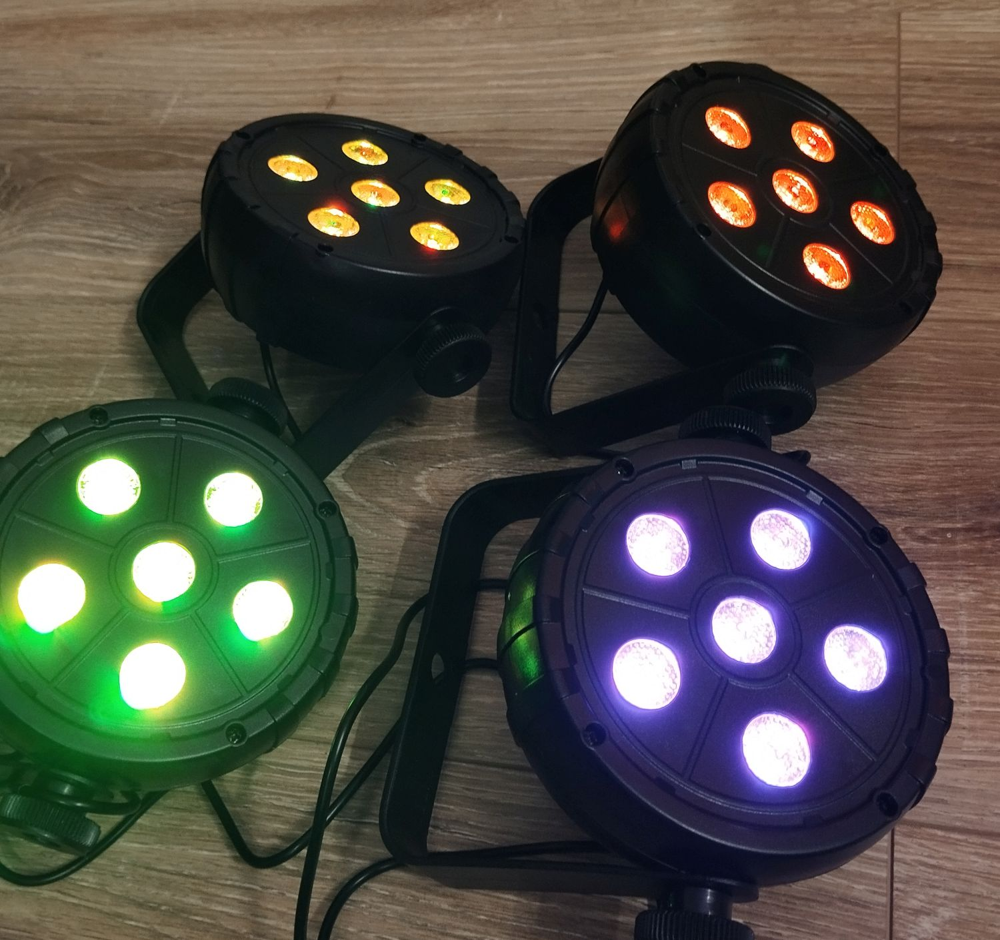
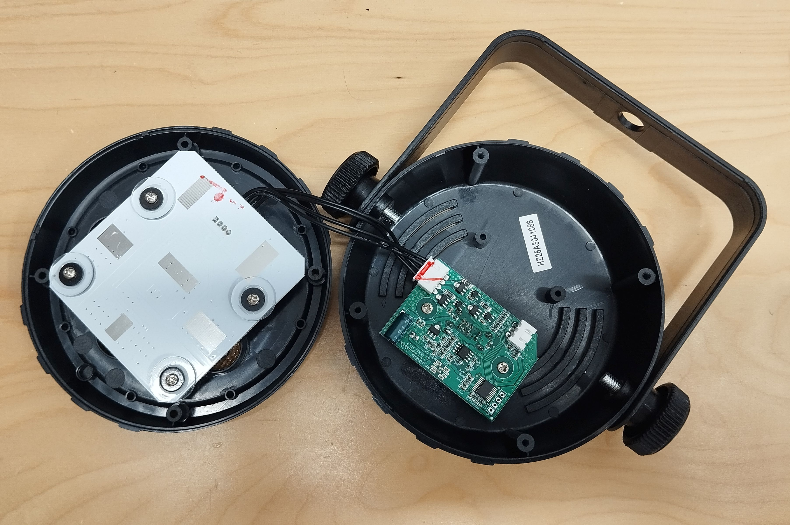
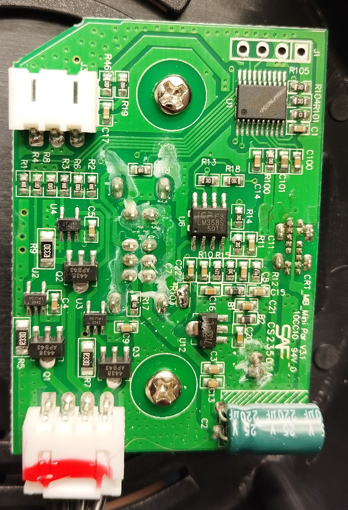
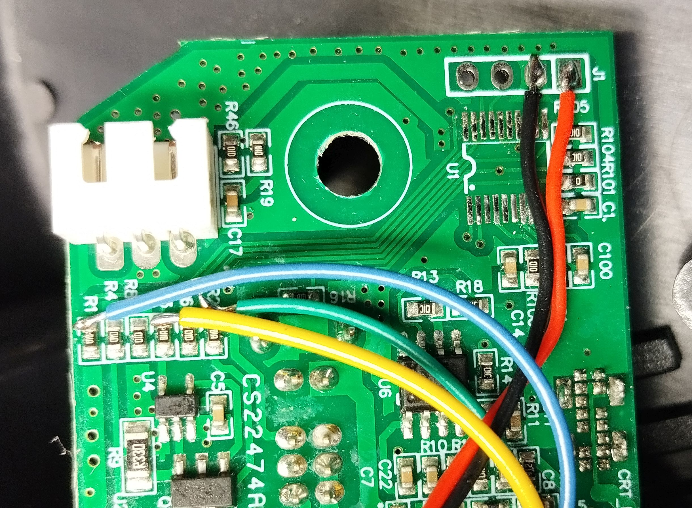
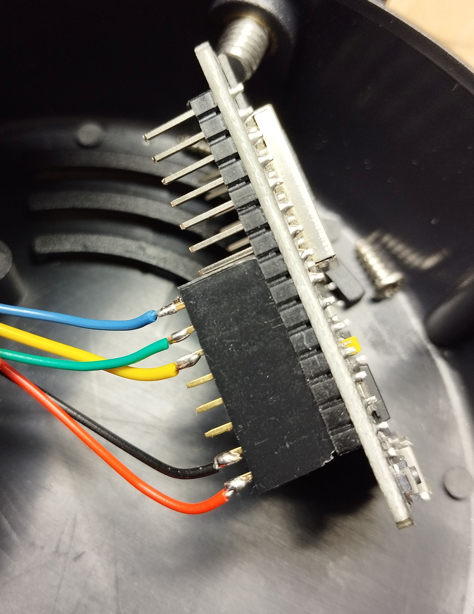
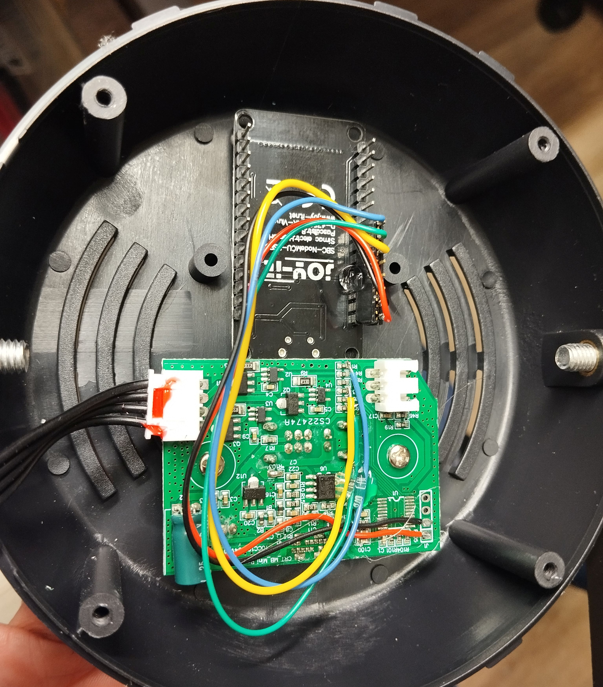

## WLED PartyPar

Modifying a cheap LED spot with WLED.

Individually adressable LED strings seem to be everywhere and can easily be controlled with an ESP board and [Wled](https://kno.wled.ge/) firmware.
But for a quick temporary decoration the power supply, wiring and housing is not convenient.
For occasional decoration, I found an easy way to have an LED spot with adjustable color.

This Project is based on a [Thomann Fun Generation USB PartyPar](https://www.thomann.de/de/fun\_generation\_usb\_partypar\_6\_rgb.htm) light. I got mine for 13,50€ each. The light comes in a plastic housing with a 5V 2A USB power supply and features 6x 3W RGB LEDs. Enough for a night-time illumination or halloween decoration.
However, on its own, the light is dumb and can only blink.

I was able to modify the circuitry to be driven by an [NodeMCU ESP32](https://joy-it.net/en/products/SBC-NodeMCU-ESP32) which fits nicely into the housing and gives a seamless upgrade. For software, the [WLED Project](https://kno.wled.ge/) directly supports setups with a single pixel and a PWM output. You get the benefit of wireless adjustments, multi-light synchronization and different animations.
It is surprisingly versatile for being just a single pixel.

### Credits

This work is inspired by [protyposis](https://protyposis.net/blog/rgb-led-party-spotlight-wled-upgrade/) and based on the [WLED project](https://kno.wled.ge/). My contribution is rather minor and I just soldered 5 wires in the right place. 

### Instructions

You need to open up the light and void the warranty (4 screws).
There is two PCBs inside, the left PCB contains the LEDs and is screwed to the front housing. The right PCB is the controls and screwed to the back of the housing.

I'm modifying the the control PCB.
We can find a microcontroller on the top right, the connector on the bottom right goes to the LED PCB.
The left side has three identical sections for driving each channel. 

I removed the built-in microcontroller to completely to disable the original functionality and added 5 wires (5V, GND, pwm\_R, pwm\_G, pwm\_B). Red and Black wires are GND and 5V for the ESP32 which conveniently go to J1.
The three channel PWM signals connect just like the control traces from the original microcontroller. I found that soldering to the resistor bank on the left seemed convenient.

The wires also need to be soldered to the ESP. I used a pin header to disconnect the EPS for flashing the firmware. The channel order could later be swapped in software. But make sure that your ESP32 is flashed with a working WLED firmware before fully assembling. I used a [NodeMCU ESP32](https://joy-it.net/en/products/SBC-NodeMCU-ESP32)  and connected the PWM to D27, D26 and D25.

Finally, the ESP32 needds to be fixed in the housing. I just hot-glued the module to the housing. With a just a dab of glue on the ESP shieldding, I have a chance of removing it later on.

### Software setup

The wled Firmware in the ESP32 needs to be set to one RGB-Pixel with PWM outputs.

### drawback and alternatives

Well - these lights are limited in brightness and are useless other than for night-time applications.
Higher powered LED fixtures exist and might still use PWM internally, but I could not find a good and cheap one.
For higher powered fixtures, the integration is easier via DMX512.
I started with an WLED ESP32 to output DMX512 and also mount this directly into a light fixture.
Unfortunately, this requires re-compilation of wled and a few more wires. Stay tuned for more.

